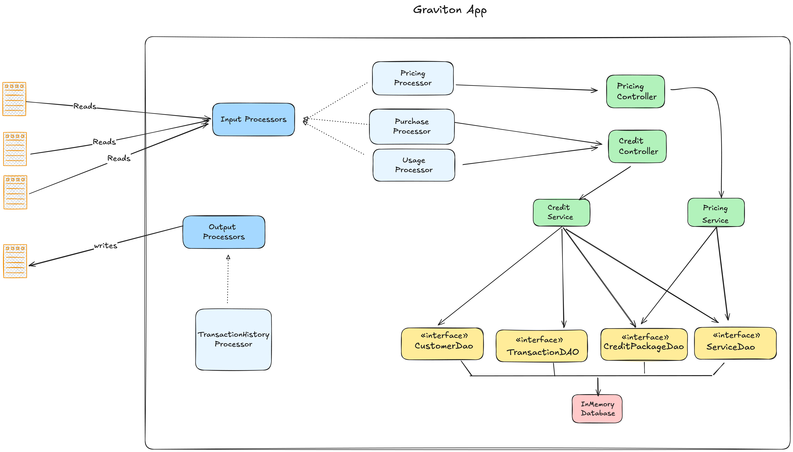

## Graviton - Credit-Based SaaS Billing System
Graviton is a credit based SaaS billing system that provides three core services with a credit-based pricing model.
The system allows customers to purchase credits, use services based on credit consumption, and track their transaction history.

### Key Features
1. **Credit Packages:** Supports multiple credit packages (Basic, Standard, Premium) for customers to purchase.
2. **Service Usage:** Customers can use three distinct services (S1, S2, S3), each with varying credit costs.
3. **Credit Management:** Tracks and updates customer credits in real-time, handling multiple credit purchases.
4. **Transaction History:** Records every purchase and service usage, ensuring a complete history of transactions.


Table of contents
=================

<!--ts-->
* [Technologies & Frameworks Used](#technologies--frameworks-used)
* [Setup Instructions](#how-to-run)
    * [Local Machine](#local-machine)
    * [Docker](#docker)
* [Architecture](#architecture)
    * [Code Structure](#code-structure)
* [Future Scope & TODO](#future-scope--todo)
<!--te-->

## Technologies & Frameworks Used
- Java 21
- [Docker](https://www.docker.com/)
- [Junit 5](https://github.com/junit-team/junit5) for Unit Testing
- [Mockito](https://github.com/mockito/mockito) for Mocking

## How to Run
##### Local Machine
###### Prerequisites
- JDK 21
- Maven
```shell
git clone git@github.com:atulgirishkumar/graviton.git

# To Build & Run graviton
mvn clean install;
java -jar target/graviton-app-1.0.0.0-fat.jar io/pricing.txt io/purchase.txt io/usage.txt io/output.txt 
```

##### Docker
###### Prerequisites
- Docker [Not Tested]
```shell
git clone git@github.com:atulgirishkumar/graviton.git

# To Build & Run graviton
cd docker; chmod +x build.sh; ./build.sh

#To view the logs for the services
docker run graviton-app io/pricing.txt io/purchase.txt io/usage.txt io/output.txt;
```

## Architecture

### Code Structure


## Future Scope & TODO
- User Management
- Dependency Injection, Logging & Configuration Management
- Authentication & Authorization mechanisms.
- Caching & Pagination support
- Downstream events via Kafka or other event streaming platform
- Distributed Tracing
- Metrics
- Open API Specification
- Automation Testing

